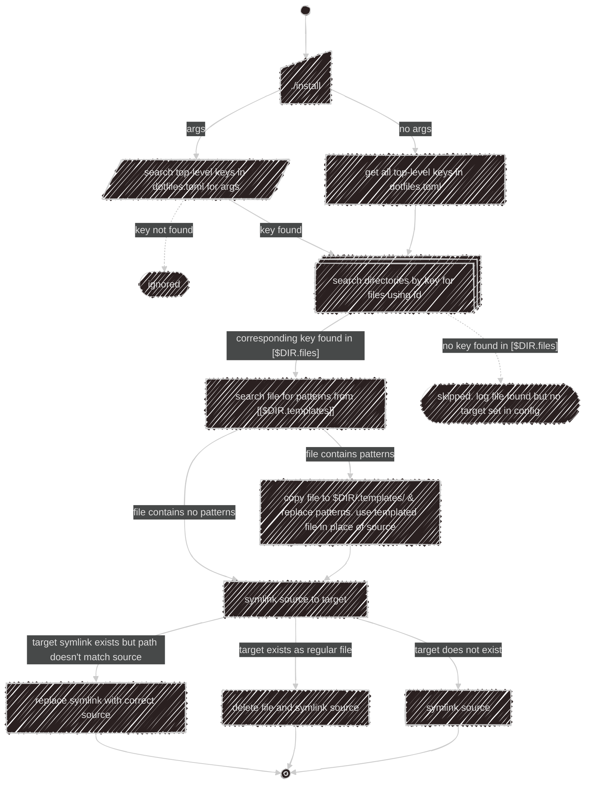

# dotfiles

A collection of my dotfiles/config/scripts, and a bash script to symlink them.

While it's mainly focused on development, I wanted to backup and share any of my latest settings, so it also tracks several unrelated files, like configurations for utilities I frequently use or games I play (_though often question why.._).

Files are [deployed](#usage) with the [`install`](install) script along with an _uncommitted_ [config file](#config) (`dotfiles.toml`), which lists source/target paths and patterns for templating/obscuring secrets. The [file structure](#file-structure) is organized for convenience and doesn't mimick or determine the destination.

There's a private submodule at the path `.secret/` for sensitive files (ssh/gnupg/etc). It's hosted on a local [gitea](https://about.gitea.com/) server and the remote url points to my own [tailnet](https://tailscale.com/kb/1136/tailnet) domain.

It follows that this isn't designed to be run in anyone else's environment as is, but hopefully it can serve as a starting point or give you ideas if you are working on a similar process. Feel free to use anything found here and please open an issue if you have any questions or suggestions. &nbsp;(:

---

> [!NOTE]
> A lot of my development is currently done on windows using git-bash, if not wsl. Some of these files may have a few quirks and hacky solutions to make things work. Certain scripts expect to be run in a windows environment, but this should be clearly commented.

---

- [dotfiles](#dotfiles)
  - [Config](#config)
    - [`[$DIR.files]`](#dirfiles)
    - [`[[$DIR.templates]]`](#dirtemplates)
  - [File Structure](#file-structure)
  - [Usage](#usage)
    - [Dependencies](#dependencies)
    - [Filtering](#filtering)
    - [Diagram](#diagram)

---

## Config

Each directory has a key in the config file of the same name with the table `files`, and an optional array of table's `templates`. These top-level keys are referenced when [running the install script](#usage).

<!-- markdownlint-disable MD001 -->

#### `[$DIR.files]`

Keys correspond to the source file (relative to the parent `$DIR`), values point to the target.

```toml
# If the target ends in `/`, then the symlink has the same name as the source file.
[yazi.files]
"yazi.toml"                   = "~/.config/yazi/"
"plugins/arrow.yazi/init.lua" = "~/.config/yazi/plugins/arrow.yazi/"

# If the target does not end in `/`, the symlink target has the new file name.
[envrc.files]
".envrc.work" = "~/work/.envrc"
```

Folders can be organized in the config file by multiple path segments.

```toml
["bin/utils".files] # key must be enclosed in quotes.
"duplicate-file-names" = "~/bin/"
```

This would link all the files at `/bin/utils/` only, instead of everything at `/bin/`. The option [`--fd-filter`/`-f`](#filtering) can be used as an alternative.

#### `[[$DIR.templates]]`

Each table contains a pattern and replacement that is run through `sd -F`. Most templates are enclosed in double curly-braces, but it can be any single or multiline string. Patterns are searched for as fixed-strings.

```toml
# direnv/direnv.toml
[whitelist]
prefix = ['{{DIRENV_WHITELIST}}']
```

```toml
# dotfiles.toml
[[direnv.templates]]
pattern     = "'{{DIRENV_WHITELIST}}'"
replacement = '"~/source", "~/work"'
```

The config file is run through `eval`, so it can contain commands/environment variables.

```toml
[fancontrol.files]
"userConfig.json" = """\
$(if target=$(dirname $(which fancontrol)); then echo -n $target/configurations; else echo '/c/program files/fancontrol/configurations'; fi)/\
"""

[[yazi.templates]]
pattern     = "~/.cache" # e.g. if a program doesn't expand tilde when reading it's config file
replacement = "$HOME/.cache"
```

The config file doesn't need to specify which source file has which templates. A patterns file is compiled and matched against each source with `rg -Ff "$patterns_file"`.

The process for linking templated files (_also see [diagram](#diagram)_) is:

  1. The directory `.templates/` is created (excluded to git by `.gitignore`).
  2. If a source file contains a pattern, it's copied to `.templates/` and the patterns in the copied file are replaced.
  3. The copied file is the new source for the symlink.

## File Structure

All files in the target directory are included except for `README.md`, `.templates/`, and `.ignore/` (for uncommitted config files, tests, ect). Files starting with 2 leading underscores are tracked but skipped when linking files.

```diff
  ┣━━ bash/
  ┃   ┣━━ .templates/
# ┃   ┃   ┃ ^ ignored by git
  ┃   ┃   ┗━━ .bashrc
# ┃   ┃         ^ copy of .bashrc with patterns replaced, used as symlink source instead of original file.
  ┃   ┃
  ┃   ┗━━ .ignore/
# ┃       ┃ ^ ignored by git
  ┃       ┗━━ .bashrc
# ┃             ^ copy of .bashrc with removed functions, tests, etc.
  ┃
  ┣━━ .bash_logout
  ┣━━ .bash_profile
  ┣━━ .bashrc
  ┣━━ .inputrc
  ┗━━ __unused__.inputrc
#       ^ ignored by `./install`
```

## Usage

### Dependencies

- [`fd`](https://github.com/sharkdp/fd)
- [`gum`](https://github.com/charmbracelet/gum)
- [`jq`](https://github.com/jqlang/jq)
- [`rg`](https://github.com/BurntSushi/ripgrep)
- [`sd`](https://github.com/chmln/sd)
- [`taplo`](https://github.com/tamasfe/taplo)

Differences on Windows:

- The expected [`ln`](https://schinagl.priv.at/nt/ln/ln.html) command used is the [`Link Shell Extension`](https://schinagl.priv.at/nt/hardlinkshellext/linkshellextension.html) cli, in place of the standard unix command `ln`. If this is detected, the option `--absolute`/`-a` is added.
- It will check for the package [`gsudo`](https://github.com/gerardog/gsudo) and run `ln -s` with it if found.

---

If no args are passed to [`install`](install), all top-level keys in the config file are used. A selection can be run by passing the names of directories as arguments.

```bash
# search for all top-level keys in config.
./install

# only search config for 2 keys.
./install yazi helix

# search for 1 key with multiple path segments
./install .secret/.ssh
```

### Filtering

The `--fd-filter` / `-f` option can be used as a filter for `fd` when searching for files.

```bash
./install -f'utils' -- bin
```

### Diagram


